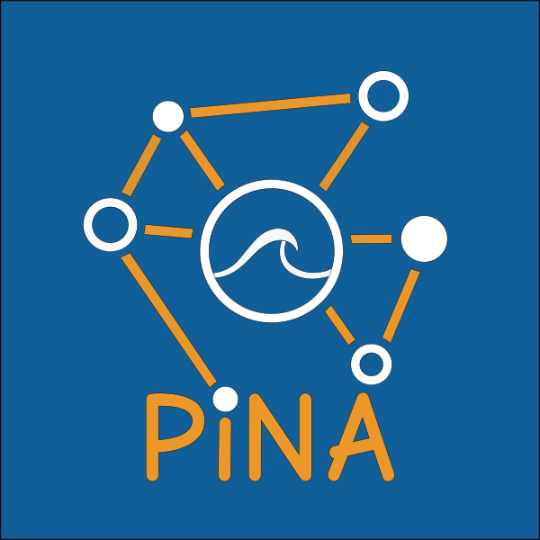
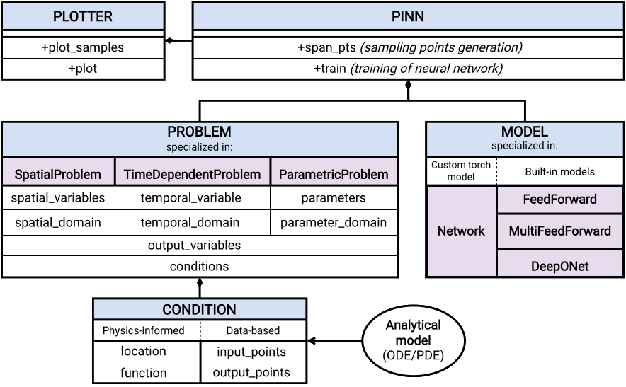

# Introduction
Artificial Intelligence (AI) strategies are massively emerging in several fields of academia and industrial research [@deng2014deep, @Wang_2005] due to the growing disposal of data, as well as the great improvement in computational resources. In the area of applied mathematics and simulations, AI strategies are being used to solve problems where classical methods fail [@pinns].
However, the amount of data required to analyze complex systems is often insufficient to make AI predictions reliable and robust. Physics-informed neural networks (PINNs) have been formulated [@RAISSI2019686] to overcome the issues of missing data, by incorporating the physical knowledge into the neural network training. Thus, PINNs aim to approximate any differential equation by solving a minimization problem in an unsupervised learning setting, learning the unknown field in order to preserve the imposed constraints (boundaries and physical residuals). Formally, we consider the general form of a differential equation, which typically presents the most challenging issues from a numerical point of view:
\begin{equation}
\begin{split}
    \mathcal{F}(\pmb{u}(\pmb{z});\alpha)&=\pmb{f}(\pmb{z}) \quad \pmb{z} \in \Omega,\\       
    \mathcal{B}(\pmb{u}(\pmb{z}))&=\pmb{g}(\pmb{z}) \quad \pmb{z} \in \partial\Omega,   
\end{split}
\end{equation}
where $\Omega\subset\mathbb{R}^d$ is the domain and $\partial\Omega$ the boundaries of the latter. In particular, $\pmb{z}$ indicates the spatio-temporal coordinates vector, $\pmb{u}$ the unknown field, $\alpha$ the physical parameters, $\pmb{f}$ the forcing term, and $\mathcal{F}$ the differential operator. In addition, $\mathcal{B}$ identifies the operator indicating arbitrary initial or boundary conditions and $\pmb{g}$ the boundary function. The PINN's objective is to find a solution to the problem, which is done by approximating the true solution $\pmb{u}$ with a neural network $\hat{\pmb{u}}_{\theta} : \Omega \rightarrow \mathbb{R}$, with $\theta$ network's parameters. Such a model is trained to find the optimal parameters $\theta^*$ whose minimizing the physical loss function depending on the physical conditions $\mathcal{L}_{\mathcal{F}}$, boundary conditions $\mathcal{L}_{\mathcal{B}}$ and, if available, real data $\mathcal{L}_{\textrm{data}}$:

\begin{equation}
    \theta^* = \underset{\theta}{\mathrm{argmin}} \mathcal{L} = 
    \underset{\theta}{\mathrm{argmin}} (\mathcal{L}_{\mathcal{F}} + \mathcal{L}_{\mathcal{B}} + \mathcal{L}_{\text{data}}).
\end{equation}

The PINNs framework is completely general and applicable to different types of ordinary differential equations (ODEs), or partial differential equations (PDEs). Nevertheless, the loss function strictly depends on the problem chosen to be solved, since different operators or boundary conditions lead to different losses, increasing the difficulty to write a general and portable code for different problems. 

{ width=20% }

\textbf{PINA}, \emph{Physics-Informed Neural networks for Advanced modeling}, is a Python library built using PyTorch that provides a user-friendly API to formalize a large variety of physical problems and solve it using PINNs easily.

# Statement of need
PINA is an open-source Python library that provides an intuitive interface for the approximated resolution of Ordinary Differential Equations and Partial Differential Equations using  a deep learning paradigm, in particular via PINNs.
The gain of popularity for PINNs in recent years, and the evolution of open-source frameworks, such as TensorFlow, Keras, and PyTorch, led to the development of several libraries, whose focus is the exploitation of PINNs to approximately solve ODEs and PDEs.
We here mention some PyTorch-based libraries, \verb+NeuroDiffEq+ [@chen2020neurodiffeq], \verb+IDRLNet+ [@peng2021idrlnet], and some TensorFlow-based libraries, such as \verb+DeepXDE+ [@lu2021deepxde], \verb+TensorDiffEq+ [@mcclenny2021tensordiffeq], \verb+SciANN+ [@haghighat2021sciann] (which is both TensorFlow and Keras-based), \verb+PyDEns+ [@koryagin2019pydens], \verb+Elvet+ [@araz2021elvet], \verb+NVIDIA SimNet+ [@hennigh2021nvidia].
Among all these frameworks, PINA wants to emerge for its easiness of usage, allowing the users to quickly formulate the problem at hand and solve it, resulting in an intuitive frameworks designed by researchers for researchers.
We have decided to build it on top of PyTorch in order to exploit the \verb+autograd+ module, as well as all the other features implemented in this framework. The final outcome is then a library with incremental complexity, capable of being used by the new users to perform the first investigation using PINNs, but also as a core framework to actively develop new features to improve the discussed methodology.

The high-level structure of the package is illustrated in Figure \ref{API_visual}; the approximated solution of a differential equation can be implemented using PINA in a few lines of code thanks to the intuitive and user-friendly interface.
Besides the user-friendly interface, PINA also offers several examples and tutorials, aiming to guide new users toward an easy exploration of the software features. The online documentation is released at \url{https://mathlab.github.io/PINA/}, while the robustness of the package is continuously monitored by unit tests. 

The API visualization in Figure \ref{API_visual} shows that a complete workflow in PINA is characterized by 3 main steps: the problem formulation, the model definition, i.e. the structure of the neural network used, and the PINN training, eventually followed by the data visualization.

{ width=70% }

## Problem definition in PINA
The first step is the formalization of the problem. 
The problem definition in the PINA framework is inherited from one or more problem classes (at the moment the available classes are \verb+SpatialProblem+, \verb+TimeDependentProblem+, \verb+ParametricProblem+), depending on the nature of the problem treated.
The user has to include in the problem formulation the following components:
\begin{itemize}
    \item the information about the domain, i.e. the spatial and temporal variables, the parameters of the problem (if any), with the corresponding range of variation;
    \item the output variables, i.e. the unknowns of the problem;
    \item the conditions that the neural network has to satisfy, i.e. the differential equations, the boundary and initial conditions.
\end{itemize}
We highlight that in PINA we abandoned the classical division between physical loss, boundary loss, and data loss: all these terms are encapsulated within the \verb+Condition+ class, in order to keep the framework as general as possible. The users can indeed define all the constraints the unknown field needs to satisfy, avoiding any forced structure in the formulation and allowing them to mix heterogeneous constraints --- e.g. data values, differential boundary conditions.

## Model definition in PINA
The second fundamental step is the definition of the model of the neural network employed to find the approximated solution to the differential problem in question.
In PINA, the user has the possibility to use either a custom \verb+torch+ network model and translate it to a PINA model (with the class \verb+Network+), or to exploit one of the built-in models such as \verb+FeedForward+, \verb+MultiFeedForward+ and \verb+DeepONet+, defining their characteristics during instantiation --- i.e. number of layers, number of neurons, activation functions. The list of the built-in models will be extended in the next release of the library.

# Acknowledgements

We thank our colleagues and research partners who contributed in the
former and current developments of PINA library.
This work was partially funded by European Union Funding for Research and Innovation — Horizon 2020 Program — in the framework of European Research Council Executive Agency: H2020 ERC CoG 2015 AROMA-CFD project 681447 “Advanced Reduced Order Methods with Applications in Computational Fluid Dynamics” P.I. Professor Gianluigi Rozza.

# References
